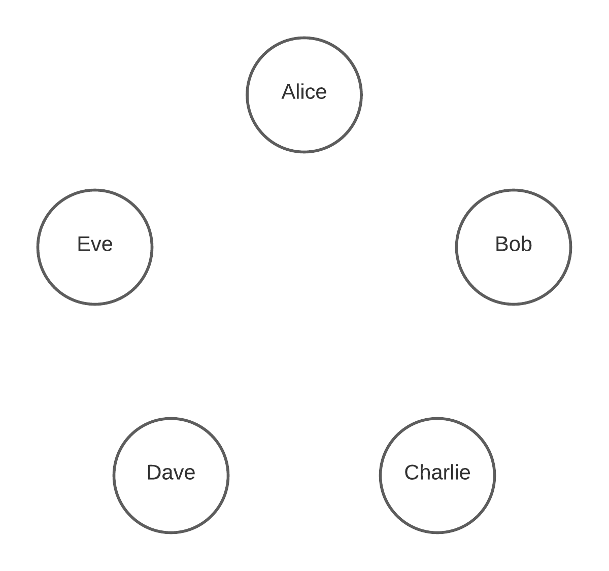
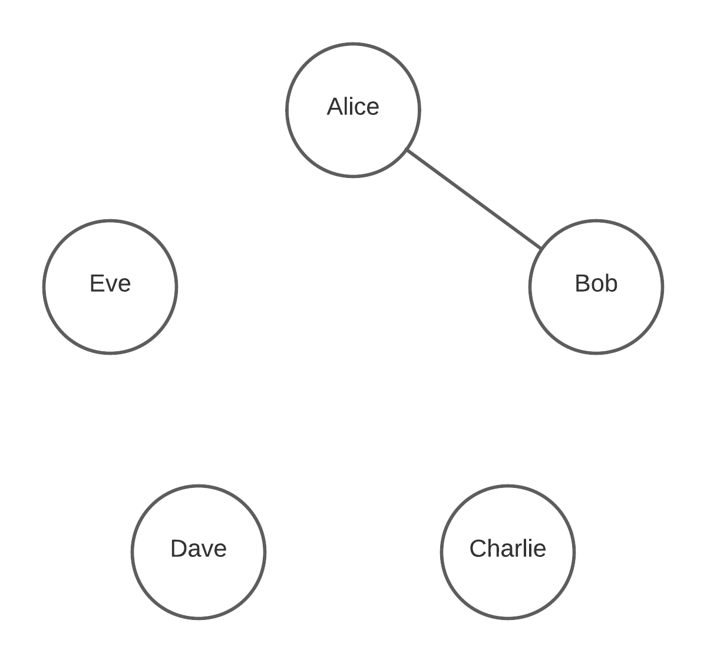
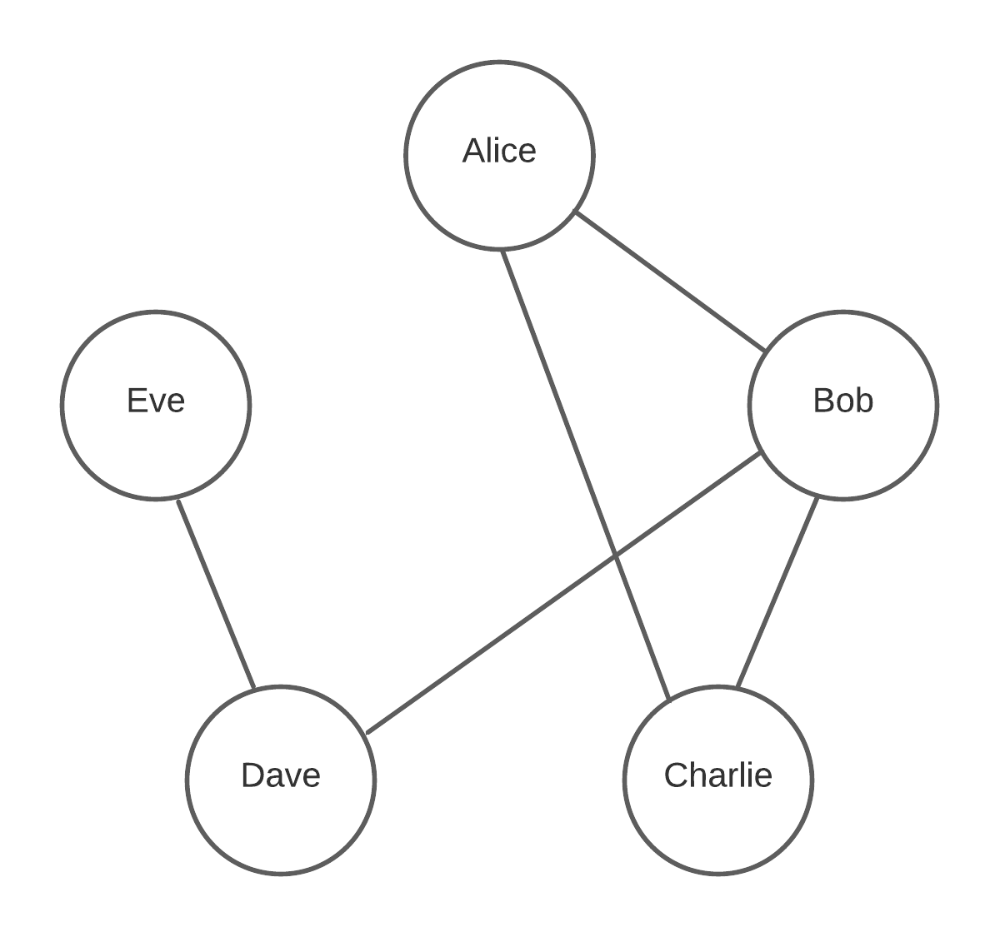
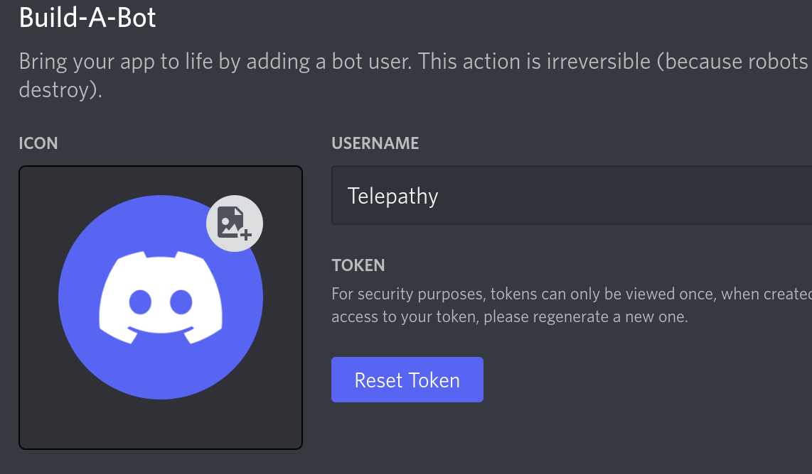
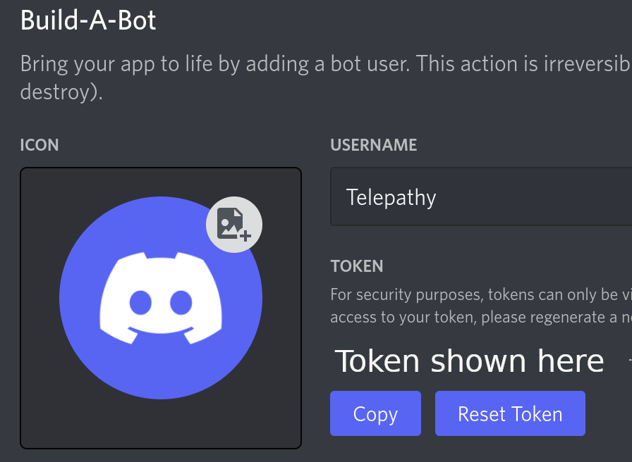
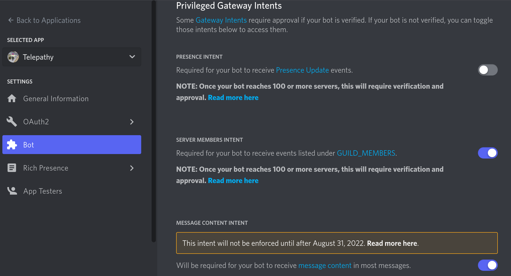
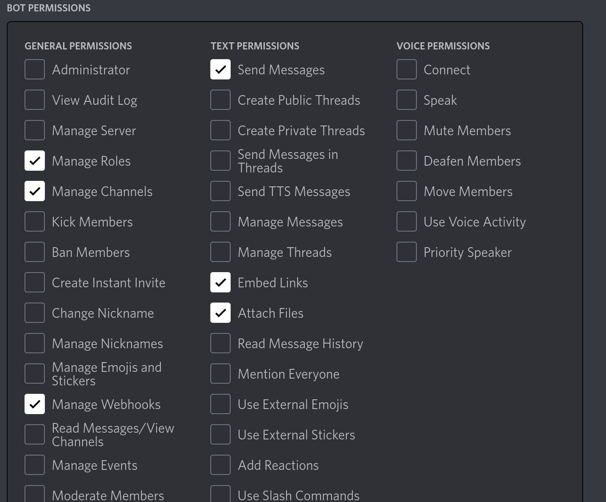

# Telepathy
A Discord application for messaging subsets of people in a server

## Background
If for some reason you find yourself wanting to communicate with others on Discord via a dynamic network topography rather than a standard channel, then this is the app for you. Telepathy provides a backend that allows users to build out custom groups through individual connections.

## Add to your server
There is no public live version of this application. However, if you want to use telepathy on your server you can [create your own](#create-your-own-telepathy-app) using the code from this repository.
## How to use
Once the Telepathy application is added to the server, create a new network with the /setuptelepathy command. A channel with a name based on the one provided in the command will be created for each user. The new network starts off with no connections, so when visualizing it looks something like this:

To create a connection with another person, use the /bond command. For example, if Alice runs `/bond Bob` in her channel, the graph will look like this:

Now when Alice sends messages in her channel they will show up in Bob's channel and vice versa. Next, if Alice adds Charlie, Charlie adds Bob, Bob adds Dave, and Dave adds Eve the graph will become:

Now when Alice sends a message in her channel it goes to Bob and Charlie. When Bob sends a message it goes to Alice, Charlie, and Dave, and so on.

To see who is currently connected to you, run the listbonds command. When Dave runs `/listbonds` the bot returns:

    Bonds: @Bob, @Eve

To remove a connection, run the unbond command. If Charlie runs `/unbond Alice` then `/listbonds` the bot will reply with:

    Bonds: @Bob

## Bot commands
### setuptelepathy
usage: /setuptelepathy [network name]

Set up private channels for each user to send telepathy messages through, along with a spectator role for the network. The network name is used to differentiate the channels and role for the created telepathy structure.

### bond
usage: /bond [user]

Add another user to your telepathy group. With the user connected, whenever you send a message in your channel they will see it in theirs. This command must be run in a telepathy channel for the connection to work.

### unbond
usage: /unbond [user]

Remove a user from your telepathy group. Removed users will no longer see messages you send in your telepathy channel. This command must be run in a telepathy channel to work.

### listbonds
usage: /listbonds

Show a list of people who are in your telepathy group. This command must be run in a telepathy channel to work.

## Create your own Telepathy app
### Create the discord app
In a web browser log in to discord and access the [developer portal](https://discord.com/developers/applications).

Select `New Application` and give it a name.

In the `General Information` tab you can give your application a name, a description, and a profile picture.

In the `Bot` tab, select `Add bot`. You can then add a profile picture and name for the bot.

In the `token` section for the bot, select `Reset Token` then `Copy`. Paste the token in  a secure location and do not share it.

Next, select at least `SERVER MEMBERS INTENT` and `MESSAGE CONTENT INTENT`:

Now select `OAuth2 > URL Generator` to create the URL for your application.

In the `scopes` section select `bot`. Then in the following `Bot Permissions` section select `Manage Roles`, `Manage Channels`, `Manage Webhooks`, `Send Messages`, `Embed Links`, and `Attach Files`.

Now copy the link at the bottom of the page. This can be used to add your bot to a Discord server.

### Backend Setup
To run Telepathy, you will need a system that will always be online when needed that can run MySQL and nodejs.

